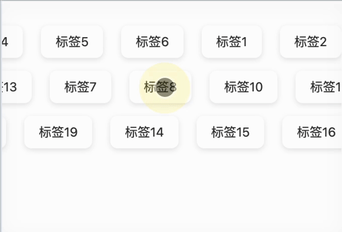

# Vue Drag Scroll Tags

一个优雅的 Vue2 标签滚动组件，支持自动滚动和拖拽交互。

<p align="center">
  
</p>

## ✨ 特性

- 🚀 流畅的自动滚动动画「上图录制的帧数低显的就比较卡」
- 🎯 支持拖拽交互
- 🎨 可自定义标签样式
- 📱 移动端友好
- 🔄 多行标签支持
- 💫 平滑的过渡效果
- 🦴 内置骨架屏加载状态
- 🎉 零依赖

## 📦 安装

```bash
# NPM
npm install vue-drag-scroll-tags

# Yarn
yarn add vue-drag-scroll-tags

# PNPM
pnpm add vue-drag-scroll-tags
```

## 🚀 快速开始

### 全局注册

```javascript
import Vue from "vue";
import DragScrollTags from "vue-drag-scroll-tags";

Vue.use(DragScrollTags);
```

### 局部注册

```vue
<template>
  <drag-scrolling-tags
    :drag-scroll-tag-list="tagList"
    :drag-scroll-tag-is-loaded="isLoaded"
    @tag-click="handleTagClick"
  >
    <template #tag="{ tag }">
      <span>{{ tag.name }}</span>
    </template>
  </drag-scrolling-tags>
</template>

<script>
import { DragScrollingTags } from "vue-drag-scroll-tags";

export default {
  components: {
    DragScrollingTags,
  },
  data() {
    return {
      isLoaded: true,
      tagList: [
        { name: "科技", id: 1 },
        { name: "生活", id: 2 },
        { name: "艺术", id: 3 },
        { name: "音乐", id: 4 },
        { name: "电影", id: 5 },
        // ... 更多标签
      ],
    };
  },
  methods: {
    handleTagClick(tag) {
      console.log("点击了标签:", tag);
    },
  },
};
</script>
```

## 📝 API

### Props

| 属性名                       | 类型    | 默认值        | 说明                       |
| ---------------------------- | ------- | ------------- | -------------------------- |
| dragScrollTagList            | Array   | []            | 标签数据列表               |
| dragScrollTagIsLoaded        | Boolean | false         | 是否加载完成               |
| dragScrollTagRows            | Number  | 3【最大为 3】 | 标签行数                   |
| dragScrollTagSkeletonColumns | Number  | 4             | 骨架屏列数                 |
| dragScrollTagDurations       | Array   | []            | 每行滚动动画持续时间（秒） |

### 事件

| 事件名    | 参数 | 说明                         |
| --------- | ---- | ---------------------------- |
| tag-click | tag  | 点击标签时触发，返回标签数据 |

### 插槽

#### tag

用于自定义标签内容的插槽。

```vue
<template #tag="{ tag }">
  <div class="custom-tag">
    
    <span>{{ tag.name }}</span>
  </div>
</template>
```

## 🎨 自定义样式

组件使用 BEM 命名规范，你可以轻松覆盖默认样式：

```css
.drag-scroll-tag__item {
  /* 自定义标签样式 */
  background: #f0f0f0;
  border-radius: 4px;
  padding: 8px 16px;
}

.drag-scroll-tag__container {
  /* 自定义容器样式 */
  height: 60px;
}
```

## 🌰 示例

### 1. 基础用法

```vue
<drag-scrolling-tags
  :drag-scroll-tag-list="tagList"
  :drag-scroll-tag-is-loaded="true"
/>
```

### 2. 自定义滚动速度

```vue
<drag-scrolling-tags
  :drag-scroll-tag-list="tagList"
  :drag-scroll-tag-durations="[20, 25, 30]"
/>
```

### 3. 自定义标签样式

```vue
<drag-scrolling-tags :drag-scroll-tag-list="tagList">
  <template #tag="{ tag }">
    <div class="custom-tag">
      <i class="icon" :class="tag.icon"></i>
      <span>{{ tag.name }}</span>
      <span class="count">{{ tag.count }}</span>
    </div>
  </template>
</drag-scrolling-tags>
```

## ⚠️ 注意事项

1. 组件依赖于 Vue 2.x 版本
2. 需要确保父容器具有明确的宽度
3. 标签数据建议预先处理好，以优化渲染性能
4. 移动端使用时，建议设置适当的 touch-action 样式
5. 如果遇到滚动卡顿，可以尝试调整 dragScrollTagDurations 的值

## 🤝 贡献指南

1. Fork 本仓库
2. 创建你的特性分支 (git checkout -b feature/AmazingFeature)
3. 提交你的改动 (git commit -m 'Add some AmazingFeature')
4. 推送到分支 (git push origin feature/AmazingFeature)
5. 提交 Pull Request

## 📄 开源协议

[MIT](LICENSE) © [Your Name]
